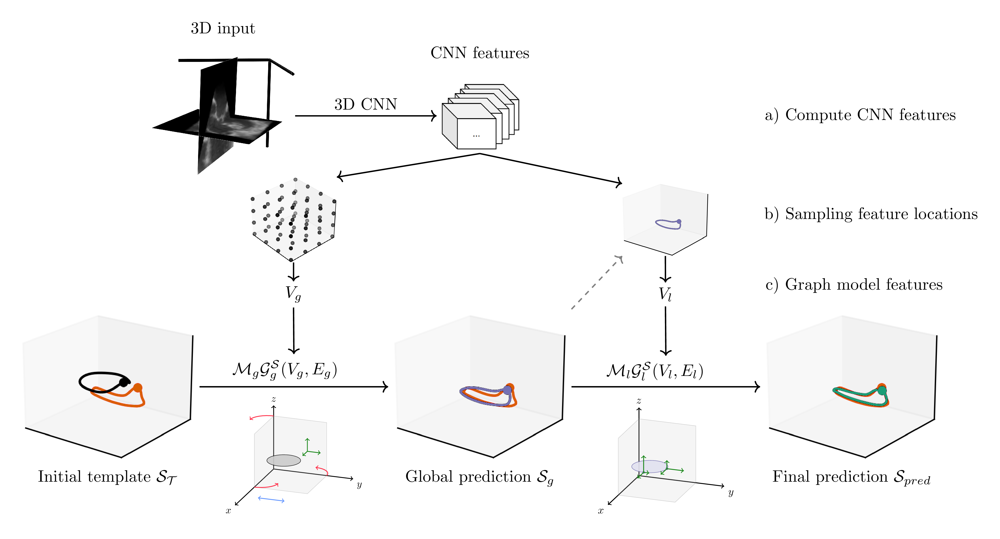
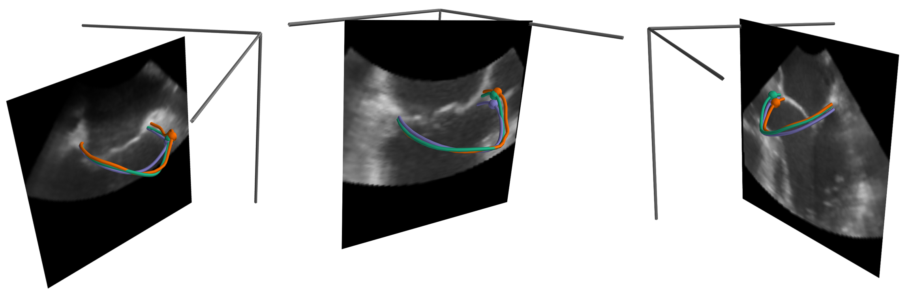

# Anatomical Constraints in Mitral Annulus Segmentation in Transesophageal Echocardiography
This repository contains the source code for the paper titled
**"Introducing Anatomical Constraints in Mitral Annulus Segmentation in Transesophageal Echocardiography"**,
by Børge Solli Andreassen, Sarina Thomas, Anne H. Schistad Solberg, Eigil Samset, and David Völgyes.

The paper is presented at the 5th International Workshop of Advances in Simplifying Medical UltraSound (ASMUS) - a workshop held in conjunction with MICCAI 2024, the 27th International Conference on Medical Image Computing and Computer Assisted Intervention.

Link to proceedings: https://link.springer.com/book/9783031736469

## Paper abstract
The morphology of the mitral annulus plays an important role in diagnosing and treating mitral valve disorders.
Automated segmentation has the promise to be
time-saving and improve consistency in clinical practice.
In the past years, segmentation has been dominated by methods based on deep learning.
Deep learning-based segmentation methods have shown good results,
but their consistency and robustness are still subjects of active research.
In this work, we introduce a method that combines Graph Convolutional Networks with a 3D CNN model
to integrate an anatomical shape template for the predictions.
Our method leverages the feature extraction capability of CNN models to provide
input features to the graph neural networks.
The proposed method leverages strengths from a shape model approach with the strengths of deep learning.
Further, we propose loss functions for the CNN designed to guide the graph model training.
The CNN was trained with transfer learning, using a limited number of labeled
transesophageal echocardiography volumes to adapt to the mitral annulus segmentation task.
When comparing the segmentation of the mitral annulus achieved by the proposed method with the test set annotations,
the method showed a high degree of accuracy,
achieving a curve-to-curve error of 2.00+/-0.81 mm and a relative perimeter error of 4.42+/-3.33%.
Our results show that the proposed method is a promising new approach
for introducing anatomical template structures in medical segmentation tasks.

## Method overview figure:

## Example results figure:


## Acknowledgement 
The research presented in this paper has benefited from the Experimental Infrastructure for Exploration of Exascale Computing (eX3),
which is financially supported by the Research Council of Norway under contract 270053.


## Get started:
The code uses Poetry for package handling.
To get started, set local Python version and install using poetry, e.g.:
```bash
pyenv local 3.11
poetry install
```

Ensure to set all paths in the configuration file
(a template file with parameters used in the paper is included in `./config`).

Also set environment variable `MVQ_CACHE_DIR` to cache dataset, if wanted.

The file `initial_shape.ptt` contains the average mitral annulus template used in the work.

Run the model training from the root of the repository:
```bash
poetry run base_model_graph.py config/<config_file_name>.yaml
```
Metrics during model training are logged to Tensorboard.

Use `test_inference.py` to get test set results (run with `--help` for arguments).

## Data
The dataset used in the paper was derived from anonymized TEE volumes acquired using GE Vivid E9 and E95 scanners.
The dataset is not publicly available due to privacy concerns.

See the VolumeHandler class for structuring your own dataset to match the format used in the code.
This class includes the preparation of distance maps used for heatmap regression during optimization.
